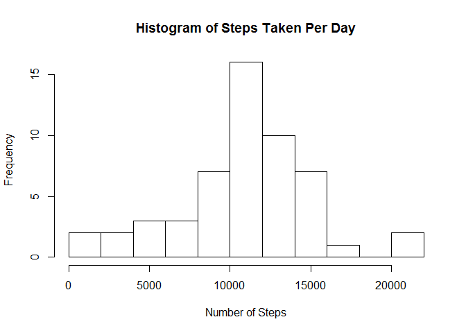
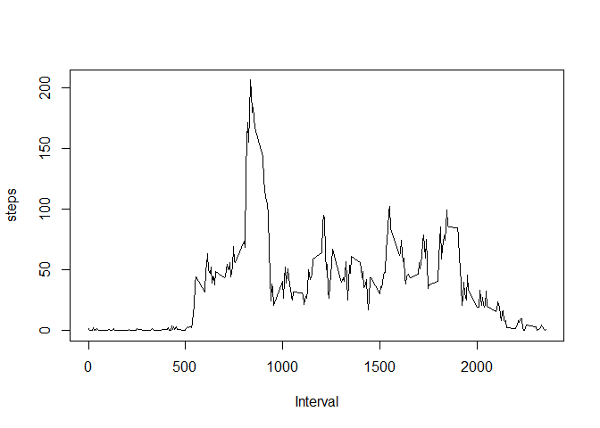
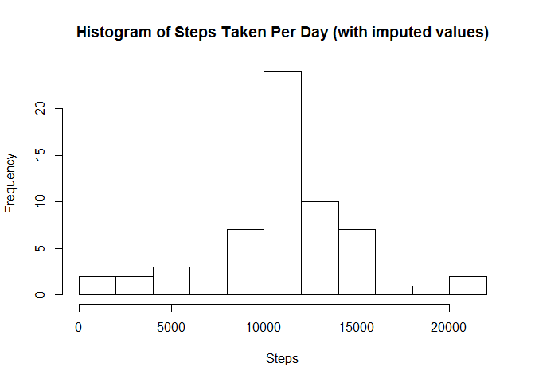
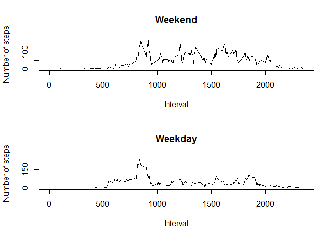

# Reproducible Research: Peer Assessment 1

## Loading and preprocessing the data

Load the data from the CSV file in the working directory.
Convert the date variable to a Date.


```r
aa = read.csv("activity.csv", stringsAsFactors=FALSE)
aa$date = as.Date(aa$date, "%Y-%m-%d")
```

## What is mean total number of steps taken per day?

Use the aggregate function to compute the total steps per day.
Missing values (NAs) are ignored (by default).
Make a histogram of the total number of steps taken each day.


```r
stepsPerDay = aggregate(steps ~ date, data=aa, FUN=sum)
hist(stepsPerDay$steps, main="Histogram of Steps Taken Per Day",
     xlab="Number of Steps", breaks=10)
```

 

Compute mean number of steps taken per day:

```r
mean(stepsPerDay$steps)
```

```
## [1] 10766.19
```

Compute median number of steps taken per day:

```r
median(stepsPerDay$steps)
```

```
## [1] 10765
```

## What is the average daily activity pattern?

Use the aggregate function to compute the mean steps per interval.  
Make a time-series plot of the 5-minute interval and the average number
of steps taken, averaged across all days.


```r
meanStepsPerInterval = aggregate(steps ~ interval, data=aa, FUN=mean)
with(meanStepsPerInterval, plot(interval, steps, type="l", xlab="Interval"))
```

 

Find the 5-minute interval (on average across all days)
that contains the maximum number of steps:


```r
idx = which.max(meanStepsPerInterval$steps)
meanStepsPerInterval$interval[idx]
```

```
## [1] 835
```

## Imputing missing values

Total number of missing values (NAs) in the dataset:

```r
sum(is.na(aa$steps))
```

```
## [1] 2304
```

Create a new dataset that is equal to the original dataset but
with the missing data filled in. The strategy for replacing NAs
is to use the mean number of steps for that 5-minute interval.


```r
aa2 = aa
for (i in 1:nrow(aa2)) {
  if (is.na(aa2$steps[i])) {
    aa2$steps[i] = meanStepsPerInterval$steps[
      meanStepsPerInterval$interval == aa2$interval[i]]
  }  
}
```

Make a histogram of the total number of steps taken each day
using the dataset with imputed values.


```r
stepsPerDay2 = aggregate(steps ~ date, data=aa2, FUN=sum)
hist(stepsPerDay2$steps,
     main="Histogram of Steps Taken Per Day (with imputed values)",
     xlab="Steps", breaks=10)
```

 

Mean steps per day (using imputed values):

```r
mean(stepsPerDay2$steps)
```

```
## [1] 10766.19
```

Median steps per day (using imputed values):

```r
median(stepsPerDay2$steps)
```

```
## [1] 10766.19
```

## Are there differences in activity patterns between weekdays and weekends?

Use the weekdays function to compute the day of week for each entry,
and then create a factor variable with two levels: weekday, weekend.


```r
aa2$weekday <- weekdays(aa2$date)
aa2$TypeOfDay = ifelse(aa2$weekday %in% c("Saturday", "Sunday"), "weekend", "weekday")
aa2$TypeOfDay = factor(aa2$TypeOfDay)
```

Make a panel plot containing a time series plot of the 5-minute interval
and the average number of steps taken, averaged across all weekday days
or weekend days.


```r
steps.weekend = aggregate(steps ~ interval, data=aa2[aa2$TypeOfDay=="weekend",], FUN=mean)
steps.weekday = aggregate(steps ~ interval, data=aa2[aa2$TypeOfDay=="weekday",], FUN=mean)

par(mfrow=c(2,1))
plot(steps.weekend$interval, steps.weekend$steps, type="l",
     xlab="Interval", ylab="Number of steps", main="Weekend",)
plot(steps.weekday$interval, steps.weekday$steps, type="l",
     xlab="Interval", ylab="Number of steps", main="Weekday")
```

 
